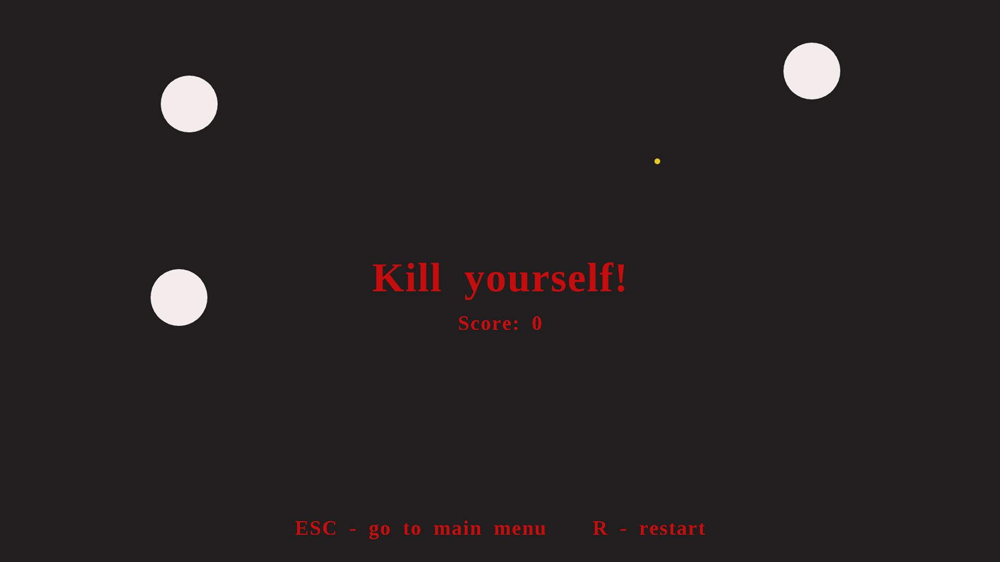

# "Одержимість"

---

Ця гра ще дурніша за "OSU"!

Витрати час без користі граючи у цю чудову гру, деградуючи у сучасному світі!



---

## Мир вам! Щоб скомпілювати гру:

#### 1: Завантажуємо RAYLIB

https://github.com/raysan5/raylib/releases

Я використовував "raylib v5.0". Завантажуємо версію для своєї системи.
Розархівовуємо. "include" та "lib" копіюємо до файлів цього проєкту.

---
#### 2: Компілюємо 

```
make product
```

Чесно кажучи, взагалі не розумію, як воно має компілюватися на лінуксі. Можливо там якісь додаткові ліби треба підключати. Лінуксоїди розберуться. Компіляція на вінді x64 нормально проходить. 

Використовував для компіляції **w64devkit**.

https://github.com/skeeto/w64devkit/releases

Нормальна тема. Там ще й raylib наче був за замовчуванням, то ж перший крок можна заігнорити.

Вихідний файл називатиметься **"obs"**. Сподіваюся, цей аматорський код нормально працюватиме.

Тема невідворотна, гряде відбій. Всіх обняв. 
